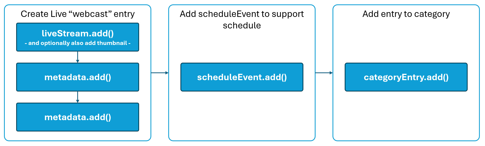
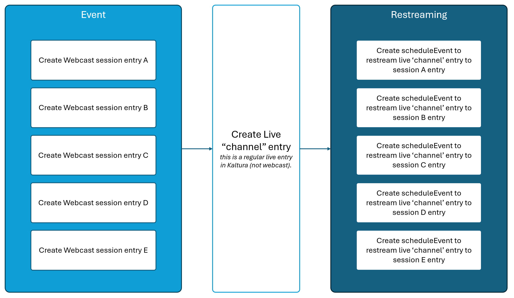

# 🎬 Kaltura Embedded Events

A developer-focused guide to integrating **Kaltura Embedded Events** into your own websites and applications.  
This repository provides **reference guides, code samples, and visuals** that illustrate the flows and components of building Kaltura Events functionality into your sites.

## 📌 Overview

Kaltura provides a rich experience and feature set as part of their Events offering, supporting large scale live broadcasts, smaller panel-style or interactive webinars, and web-based broadcast studios.  There is also a robust set of interactions available to attendees including chat, Q&A, polls, rating scales, quizzes, word clouds, surveys, emoji reactions, and more.  On top of that Kaltura offers the flexibility to customize and control the experience with your own branding, theme controls, and/or full CSS.

This guide will be broken into two main topics:
* 1️⃣ The creation of the various session types supported in Kaltura.  This can be done inside Kaltura applications, but also via API, which we will discuss.
* 2️⃣ The authentication of users and rendering of the embedded session iframe for your site/application.

## 📋 Prerequisites

* A Kaltura account with a KAFTestMe instance and all events features enabled.
  * The KAFTestMe offers a simple and flexible endpoint to allow the loading of the full session experience within a simple, easy to use iframe.
* An admin appToken for accessing the Kaltura API.
  * see https://developer.kaltura.com/api-docs/VPaaS-API-Getting-Started/Getting-Started-VPaaS-API.html for guides and general reference on using the Kaltura API, including access to [Client Libraries in a number of languages](https://developer.kaltura.com/api-docs/Client_Libraries).  While there are other methods, Kaltura strongly encourages the [use of appTokens for authenticating to the API.](https://developer.kaltura.com/api-docs/VPaaS-API-Getting-Started/application-tokens.html)
  * This guide assumes you are already familiar with authenticating to the Kaltura API and making calls.

## 📚 Important Terms

There are a few concepts and terms we should understand before getting started:
* 📺***Webcast session*** - this is different from a regular live stream.  A Webcast entails a live entry, but also scheduling components for when the stream will start and end.  A Webcast also enables the ability to access the Webcast studio, allowing addition of slides and other storyboard components, as well as a mini monitoring console.  Webcast sessions are most commonly driven from a hardware or software encoder broadcasting RTMP(S) or SRT into Kaltura.  Attendees of these sessions watch the stream via the Kaltura video player.
* 📸***Interactive/Webinar session*** - this is basically a WebRTC meeting room, with two different modes:  
  * In an **Interactive session**, everyone will join the room with cams/mics "on stage" so that everyone can interact with each other in real time.  These sessions are great for things like sponsor booths, demo rooms, interactive trainings, breakouts, virtual classrooms, and more.
  * In a **Webinar session**, it is the same room experience with the exception that only speakers and moderators can initially join the meeting with cam/mic "on stage" while all other attendees join in a listen mode (no cam/mic) "off stage" (however, they can still raise hand or request to join, and a moderator can allow them to activate cam/mic and join the stage).  These session types are better suited to presentation sessions where the presenters are delivering content to many but don't need it to be fully interactive with every attendee, while still having the flexibility to bring people on stage where they can be seen/heard.
* 🎥***Webcast Studio session*** - this is a combination of the former two.  For speakers and moderators, there is a WebRTC meeting room with features such as a green room for stage management, storyboard for organizing a run-of-show, and other tools, allowing the creation of a customized, high production-level event.  The room then also has controls for allowing what is being produced in the room to then be broadcast out to a Webcast session, where attendees will be able to watch the session through the Kaltura video player.  This allows basically unlimited scale in the number of attendees that are able to join the session.
* 📼***Simulive, or Pre-recorded, session*** - this session type is basically like a Webcast session, but instead of having to have an encoder broadcast the stream, you can use a pre-recorded video asset and have it stream 'live' at a prescribed date and time.  This offloads the pressure and risk of a live production and allows you to deliver the highest quality post-produced and edited content while still leveraging the social aspects of a live event.

All of these session types still allow everyone to participate in the Chat and Collaboration (CNC) features (mentioned above in the overview).

* 📦 ***Kaltura Application Framework, or KAF*** - this is a Kaltura application instance that exposes various UI component endpoints to third party applications.  In this scenario, we'll be using one of those endpoints to render an embeddable iframe that contains the Kaltura session (Kaltura player for webcast or simulive sessions, or Kaltura room for interactive/webinar or Studio sessions).  KAF also provides mechanisms for customizing branding, language packs, and other things, but in this guide we'll focus primarily on the relevant endpoints for the embedded experience.  A KAF application instance should be provisioned for you by Kaltura and will have a unique url for accessing it.

* 🧩 ***Entries, categories, and scheduleEvents*** - entries, categories, and scheduleEvents are Kaltura API objects.  
An *[entry](https://developer.kaltura.com/api-docs/service/baseEntry)* is an archetype.  Various *entry* implementations include live streams, rooms, and media.  We'll be using all three of these in this guide. 
A *[category](https://developer.kaltura.com/api-docs/service/category)* is used as an organizational concept allowing you to associate multiple entries together.  Categories can also be used to enforce permissions, or entitlements, to govern access to entries.  In Kaltura applications, categories are commonly surfaced as Channels.  In this guide, we'll use categories to organize sessions into events, or tracks. 
A *[scheduleEvent](https://developer.kaltura.com/api-docs/service/scheduleEvent)* is a type of wrapper for an entry that allows specifying additional attributes like startDate, endDate, organizer, and others. 

## 🚀 Getting Started

Let's dive in!

### 1️⃣ Session Creation

Creating any of the various session types will consist of multiple API calls.

#### 📺***Webcast session*** 

Flow overview:

* To create a Webcast session, we'll first need to make the [liveStream.add()](https://developer.kaltura.com/api-docs/service/liveStream/action/add) API call.  This will create the liveStream *entry* in Kaltura.  There are a number of attributes associated with a liveStream, but the most relevant ones are:
  * liveStreamEntry->dvrStatus : this can be ENABLED or DISABLED, depending on if you wish to support DVR for the session.
  * liveStreamEntry->dvrWindow : an integer value representing the number of minutes for the DVR window (only use if you are enabling DVR as well).
  * liveStreamEntry->viewMode : ALLOW_ALL or PREVIEW.  Allow all means that the stream will be delivered to the player immediately upon the start of the encoder.  Preview enables a Kaltura producer or admin to Preview the stream in the backend before releasing it to the player for attendees to stream.
  * liveStreamEntry->mediaType : in most cases, this should be set to LIVE_STREAM_FLASH to support RTMP(S) ingest.
  * liveStreamEntry->sourceType : this should be set to LIVE_STREAM.
  * liveStreamEntry->adminTags : adminTags should be supplied as a comma separated string of tags.  For this scenario, we need "kms-webcast-event,kwebcast" , but these can also be used to associate any backend tagging (not visible to endusers) to help identify or classify your content, so you may add additional ones as needed.  NOTE: you may also consider using the liveStreamEntry->referenceId attribute to store external system ids for easier mapping.
  * liveStreamEntry->conversionProfileId : this is optional and allows you to specify a certain transcoding profile, or conversionProfile.  If omitted, the system default live profile will be used.
  * liveStreamEntry->tags : these are user-facing tags, and should be supplied as a comma separated string.
  * liveStreamEntry->type : should be set to LIVE_STREAM.
  * liveStreamEntry->userId : this is the id of the user who will be the owner of the entry.  Can be a specific user, generic, or even a Group.
  * liveStreamEntry->name : this is the name of the session, and what will show on the session card before the session starts.
  * liveStreamEntry->description : additional details about the session.
  * liveStreamEntry->recordStatus : DISABLED, APPENDED, or PER_SESSION.  With appended, the recording will append any time the encoder stops and then starts.  With per-session, there will be a new recording entry created each time the encoder stops and starts again.
  * liveStreamEntry->recordingOptions : options that allow further specification of how recordings should be handled.  Ex: liveStreamEntry->recordingOptions->shouldCopyThumbnail allows specifying if the recording should inherit the thumbnail of the live entry.
* Add a thumbnail for the session by using either [a hosted file](https://developer.kaltura.com/api-docs/service/liveStream/action/updateOfflineThumbnailFromUrl) or [uploading one](https://developer.kaltura.com/api-docs/service/liveStream/action/updateOfflineThumbnailJpeg).
* Now that we have the liveStream *entry*, we need to take a couple extra steps to ensure we define it as a Webcast session:
  * We need to add a couple of metadata values to the liveStream to classify it as a Webcast.  There are many possible metadata schemas in Kaltura, so we need to look up the appropriate ones for this.  We can do so using the *[metadataProfile.list()](https://developer.kaltura.com/api-docs/service/metadataProfile/action/list) API* to find them and then use the *[metadata.add()](https://developer.kaltura.com/api-docs/service/metadata/action/add) API* to set the metadata values for the *entry*.
    * Find the metadataProfile for "KwebcastProfile":
      * filter = new KalturaMetadataProfileFilter()
      * filter->metadataObjectTypeEqual = KalturaMetadataObjectType::ENTRY
      * filter->nameEqual = "KwebcastProfile"
      * pager = new KalturaFilterPager()
      * metadataProfile->listAction($filter, $pager)
    * Once you have the metadataProfile from the above request, then we can go about setting the metadata for the liveStream *entry*.
      * metadataProfileId = {INTEGER_PROFILE_ID_FROM_PREVIOUS_STEP}
      * objectType = KalturaMetadataObjectType::ENTRY
      * objectId = {ENTRY_ID_OF_LIVE_STREAM}
      * xmlData = "<metadata><SlidesDocEntryId></SlidesDocEntryId><IsKwebcastEntry>1</IsKwebcastEntry><IsSelfServe>0</IsSelfServe></metadata>"
      * metadata->add(metadataProfileId, objectType, objectId, xmlData) 
    * Repeat the metadataProfile.list() steps above to get the metadataProfile for "EventsProfile3".  This metadata is used to handle the session countdown timer on the session card prior to the session beginning.
    * Once you have the metadataProfile from the above request, then set the metadata.
      * metadataProfileId = {INTEGER_PROFILE_ID_FROM_PREVIOUS_STEP}
      * objectType = KalturaMetadataObjectType::ENTRY
      * objectId = {ENTRY_ID_OF_LIVE_STREAM}
      * xmlData = "<metadata><StartTime>{EPOCH_TIMESTAMP_START_DATETIME}</StartTime><EndTime>{EPOCH_TIMESTAMP_END_DATETIME}</EndTime><Timezone>{TIMEZONE; ex:America/New_York}</Timezone></metadata>"
      * metadata->add(metadataProfileId, objectType, objectId, xmlData)
  * We also need to add a *scheduleEvent* wrapper for the liveStream using the *[scheduleEvent.add() method](https://developer.kaltura.com/api-docs/service/scheduleEvent/action/add)*.  The relevant attributes are:
    * scheduleEvent : the scheduleEvent object type should be a KalturaLiveStreamScheduleEvent
    * scheduleEvent->templateEntryId : this should be the id of the liveStream that was returned when creating the liveStream entry.
    * scheduleEvent->classificationType : should be set to PUBLIC_EVENT.  This is used when showing the event on calendar UI's inside Kaltura applications.
    * scheduleEvent->summary : this should represent the name of the session, and is most often the same as the name of the liveStream *entry*.
    * scheduleEvent->tags : these are user-facing tags, and should be supplied as a comma separated string. NOTE: you may also consider using the scheduleEvent->referenceId attribute to store external system ids for easier mapping.
    * scheduleEvent->organizer and scheduleEvent->ownerId : these can be the same value, and can be a specific user, generic, or even a Group.  This controls who can see the event on calendar UI's inside Kaltura applications.
    * scheduleEvent->recurrenceType : in this scenario, the recurrence type will almost always be NONE.
    * scheduleEvent->startDate : epoch timestamp of when the session will start
    * scheduleEvent->endDate : epoch timestamp of when the session will end
    

### 2️⃣ KAF Embed Rendering

# Basic Workflow

# Workflow Description
The general flow implemented by a vendor would follow this outline:
1. Connect to Kaltura API and establish a valid session
2. Call [entryVendorTask.getJobs()](https://developer.kaltura.com/api-docs/service/entryVendorTask/action/getJobs) to get a list of jobs that have been submitted by any customer users for your services
3. Loop through the job objects in the response and get additional job details with [entryVendorTask.get()](https://developer.kaltura.com/api-docs/service/entryVendorTask/action/get)
4. Retrieve the asset related using details from [baseEntry.getPlaybackContext()](https://developer.kaltura.com/api-docs/service/baseEntry/action/getPlaybackContext) and the [playManifest API](https://developer.kaltura.com/api-docs/Deliver-and-Distribute-Media/playManifest-streaming-api.html)
5. Update the job status to PROCESSING using [entryVendorTask.updateJob()](https://developer.kaltura.com/api-docs/service/entryVendorTask/action/updateJob)
6. Process the requested job in the vendor backend/app.  Upon job completion on the vendor side, use the partnerId and accessKey (from the job request object) to add the generated assets (ex: captions, transcript, chapters, etc) to the requested media in the customer account
7. Update the job status to READY using [entryVendorTask.updateJob()](https://developer.kaltura.com/api-docs/service/entryVendorTask/action/updateJob)

## Workflow step details and notes
1. Connect to the Kaltura API using your Vendor account.  The Kaltura Partners team can provide you with this account and the relevant details.  We strongly suggest provisioning an appToken for this account and using that to spawn your API sessions. See [Getting started with application tokens](https://developer.kaltura.com/api-docs/VPaaS-API-Getting-Started/application-tokens.html) for more information on appToken sessions.  Also, you can find [pre-compiled Kaltura API client libraries in a number of languages](https://developer.kaltura.com/api-docs/Client_Libraries) to help you get started.
   - The client lib exposes the ability to define a Client Tag for each API request. This property is used later by Kaltura to track which application issued which call. With REACH we make another use of this field. To ensure Kaltura has a way to determine the Task processing E2E, the vendor should follow the following standards:
     - For non task-specific API calls, the client tag should be set to be '<default clientTag>_vendorName-vendorPartnerId'. (default clientTag consists of the client library programming language and the library build date) . Example: 'php5:18-11-11_vendorName_12345'
     - For task-specific API calls, the Task ID should also be added to the clientTag: Example, for PHP5 client library, Task ID (9292) and vendor account id (12345), the resulting client tag should be "php5:18-11-11_vendorName-12345-9292"
   - The appToken should be set with 'disableentitlement' privilege.  The default expiry is 24 hours, but can be set as desired.
2. Once you have a valid client session established, make a call to [entryVendorTask.getJobs()](https://developer.kaltura.com/api-docs/service/entryVendorTask/action/getJobs).  This will return a list of requested jobs for your Vendor account.  Make sure to use the following parameters in your request:
   - entryVendorTaskFilter->vendorPartnerIdEqual - set this parameter to be the vendor partner ID (should be the same value for all tasks)
   - entryVendorTaskFilter->statusEqual = PENDING - this will only return a list of tasks that are PENDING processing by the vendor.
   - depending on the number of tasks, you may need to use the pager object to paginate results
3. Once you have the full list of tasks, then you'll need to connect to each customer account to retrieve additional details about the request (custom dictionaries, whether or not to set the captions to auto-display, etc).  To do so, you'll loop through the list of tasks and make a call to [entryVendorTask.get()](https://developer.kaltura.com/api-docs/service/entryVendorTask/action/get).  When making this call, you'll need to supply the following parameters:
   - id - this is the task id and will have been included in the task object from the entryVendorTask.getJobs() call.
   - ks - this is a global parameter in the API client.  For this call, you'll need to change your client KS (Kaltura Session) to match the accessKey returned in the task object.  This KS is associated to the specific customer account and media related to the originating task request.  This value will change with each task you are looping through, so be sure to set it accordingly for each task.
   - responseProfile - this is also a global parameter in the API client.  The object type should be ResponseProfileHolder, and you should set the systemName attribute value to 'reach_vendor'.  This tells the API to return additional information related to the Customer's REACH profile such as dictionaries, processing region, caption display settings, and other pertinent details.  This will UNSET after each API call, so it will need to be reset for each subsequent call, much like the KS.
4. Depending on if the job request is for VOD or Live assets, then our next step will vary.
   * For VOD, once you have the task details, you'll need to get the media for the specified request.  You'll have the option to download the needed flavor (transcoded rendition), or obtain an HLS manifest to allow you to stream the file (audio, video, or both) and concatenate the segments on your end to rebuild them into a file.  To do so, maintain the specific KS for the task, and make a call to [baseEntry.getPlaybackContext()](https://developer.kaltura.com/api-docs/service/baseEntry/action/getPlaybackContext). 
       - Supply the following parameters:
         - ks - ensure that the KS matches the accessKey from the original task request.
         - entryId - this id will have been supplied in the original task request.
         - contextDataParams->objectType = KalturaPlaybackContextOptions
         - contextDataParams->streamerType = "http" if you want the downloadable file, or "applehttp" if you want HLS manifest(s).
         - contextDataParams->ks = the ks, or accessKey, from the original task object
       - Based on the response from the above call, you should have the needed information to get the needed media.  See [information on the playManifest API](https://developer.kaltura.com/api-docs/Deliver-and-Distribute-Media/playManifest-streaming-api.html) for details on constructing stream or download urls for the media. Be sure to include the customer partnerId and ks (accessKey) that were provided in the original request task object.
         - if you wish to ultilize HLS and only retrieve the audio track, or just the video track, see [url path parameters](https://github.com/kaltura/nginx-vod-module#url-path-parameters) for details.
   * For live, you should have a 'scheduleEventId' that comes in the entryVendorTask details, along with the scheduled start and end times for the live event.  After provisioning your services for the live session, you should call [scheduleEvent.updateLiveFeature()](https://developer.kaltura.com/api-docs/service/scheduleEvent/action/updateLiveFeature) to provide the following data back to Kaltura:
       - mediaUrl and mediaKey - an RTMP(S) stream ingest url and key where Kaltura should relay the live stream to you.
       - captionUrl and captionToken - a websocket address and token where Kaltura should connect at the scheduled event time to receive caption data from you over a realtime websocket.
       - see [Creating Assets](resources/Creating_Assets.md) for more information.
5. Once you have the media or stream and begin to process the task, you'll need to update the task status.  To do so, call the [entryVendorTask.updateJob()](https://developer.kaltura.com/api-docs/service/entryVendorTask/action/updateJob) endpoint.  For normal scenarios, you'll update the job with the following:
   - status = PROCESSING .  For live jobs that will be executed at a future scheduled date, set the status = SCHEDULED upon provisioning the job, then update the task again to status = PROCESSING when you begin to process the task.
   - ks - make sure the set your KS back to your vendor KS that was generated with your vendor appToken when your polling process began.
6. Upon completion of processing the request on the vendor side, you'll need to update the entry in Kaltura with the relevant generated assets (caption, transcript, chapters, audio description track, etc).  Depending on the service requested and the generated output, you may need to use additional methods to create things like captions, transcripts, chapters, additional audio tracks, etc:
   - see [Creating Assets](resources/Creating_Assets.md) for more information.
   - For all calls, be sure to use the accessKey (ks), partnerId, and entryId that were specified in the original task object.  In addition, some object types may need reference to other objects (like captionAsset has a parameter for reference to the transcript (attachmentAsset), so be sure to supply those where needed.  If you have additional questions, feel free to ask the Kaltura Partners team for added guidance.
7. After adding the requested assets to the entry, update the job status again using [entryVendorTask.updateJob()](https://developer.kaltura.com/api-docs/service/entryVendorTask/action/updateJob).
   - be sure to reset the ks back to your vendor ks.
   - on success, set the 'status' to 'READY', and the outputObjectId to the id  returned for the asset you created (if multiple, just use the first or most prominent)
   - for any kind of error encountered, set the 'status' to 'ERROR', and use the 'errDescription' field to provide more details on the error.
   - use the 'externalTaskId' parameter to store any relevant task processing identifiers in your system.  This will help if we ever need to track a task back to you to troubleshoot or provide additional information.
 
## 🧩 Additional Information
In this guide we discussed the programmatic creation of the various types of event sessions, and what it looks like to render those sessions within your own applications.  The assumption up to this point is that each session would have it's own 'landing page' within your application.  However, KAF has a bonus feature of an endpoint that would allow for an entire list/agenda of sessions to be shown in a single view.  This can be useful if you want to simplify your site and not have to maintain the landing page wrapper for every session separately.

See [resources](resources) for more help. 

Bonus: When you have multiple Webcast sessions, but only want to have a single ingest point for your encoder, you can create a type of "restreamer live channel", which is a single entry point providing a single set of RTMP(S)/SRT ingest urls while restreaming from that single entry point to any of the desired associated Webcast sessions.

   
   

