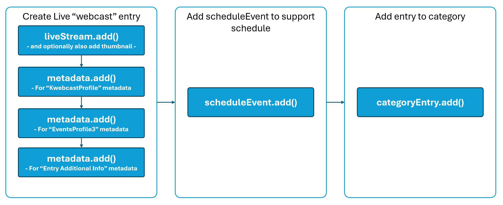

# 🎬 Kaltura Embedded Events

A developer-focused guide to integrating **Kaltura Embedded Events** into your own websites and applications.  
This repository provides **reference guides, code samples, and visuals** that illustrate the flows and components of building Kaltura Events functionality into your sites.

## 📌 Overview

Kaltura provides a rich experience and feature set as part of their Events offering, supporting large scale live broadcasts, smaller panel-style or interactive webinars, and web-based broadcast studios.  There is also a robust set of interactions available to attendees including chat, Q&A, polls, rating scales, quizzes, word clouds, surveys, emoji reactions, and more.  On top of that Kaltura offers the flexibility to customize and control the experience with your own branding, theme controls, and/or full CSS.

This guide will be broken into two main topics:
* 1️⃣ The creation of the various session types supported in Kaltura.  This can be done inside Kaltura applications, but also via API, which we will discuss.
* 2️⃣ The authentication of users and rendering of the embedded session iframe for your site/application.

## 📋 Prerequisites

* A Kaltura account with a KAFTestMe instance and all events features enabled.
  * The KAFTestMe offers a simple and flexible endpoint to allow the loading of the full session experience within a simple, easy to use iframe.
* An admin appToken for accessing the Kaltura API.
  * see https://developer.kaltura.com/api-docs/VPaaS-API-Getting-Started/Getting-Started-VPaaS-API.html for guides and general reference on using the Kaltura API, including access to [Client Libraries in a number of languages](https://developer.kaltura.com/api-docs/Client_Libraries).  While there are other methods, Kaltura strongly encourages the [use of appTokens for authenticating to the API.](https://developer.kaltura.com/api-docs/VPaaS-API-Getting-Started/application-tokens.html)
  * This guide assumes you are already familiar with authenticating to the Kaltura API and making calls.

## 📚 Important Terms

There are a few concepts and terms we should understand before getting started:
* 📺***Webcast session*** - this is different from a regular live stream.  A Webcast entails a live entry, but also scheduling components for when the stream will start and end.  A Webcast also enables the ability to access the Webcast studio, allowing addition of slides and other storyboard components, as well as a mini monitoring console.  Webcast sessions are most commonly driven from a hardware or software encoder broadcasting RTMP(S) or SRT into Kaltura.  Attendees of these sessions watch the stream via the Kaltura video player.
* 📸***Interactive/Webinar session*** - this is basically a WebRTC meeting room, with two different modes:  
  * In an **Interactive session**, everyone will join the room with cams/mics "on stage" so that everyone can interact with each other in real time.  These sessions are great for things like sponsor booths, demo rooms, interactive trainings, breakouts, virtual classrooms, and more.
  * In a **Webinar session**, it is the same room experience with the exception that only speakers and moderators can initially join the meeting with cam/mic "on stage" while all other attendees join in a listen mode (no cam/mic) "off stage" (however, they can still raise hand or request to join, and a moderator can allow them to activate cam/mic and join the stage).  These session types are better suited to presentation sessions where the presenters are delivering content to many but don't need it to be fully interactive with every attendee, while still having the flexibility to bring people on stage where they can be seen/heard.
* 🎥***Webcast Studio session*** - this is a combination of the former two.  For speakers and moderators, there is a WebRTC meeting room with features such as a green room for stage management, storyboard for organizing a run-of-show, and other tools, allowing the creation of a customized, high production-level event.  The room then also has controls for allowing what is being produced in the room to then be broadcast out to a Webcast session, where attendees will be able to watch the session through the Kaltura video player.  This allows basically unlimited scale in the number of attendees that are able to join the session.
* 📼***Simulive, or Pre-recorded, session*** - this session type is basically like a Webcast session, but instead of having to have an encoder broadcast the stream, you can use a pre-recorded video asset and have it stream 'live' at a prescribed date and time.  This offloads the pressure and risk of a live production and allows you to deliver the highest quality post-produced and edited content while still leveraging the social aspects of a live event.

All of these session types still allow everyone to participate in the Chat and Collaboration (CNC) features (mentioned above in the overview).

* 📦 ***Kaltura Application Framework, or KAF*** - this is a Kaltura application instance that exposes various UI component endpoints to third party applications.  In this scenario, we'll be using one of those endpoints to render an embeddable iframe that contains the Kaltura session (Kaltura player for webcast or simulive sessions, or Kaltura room for interactive/webinar or Studio sessions).  KAF also provides mechanisms for customizing branding, language packs, and other things, but in this guide we'll focus primarily on the relevant endpoints for the embedded experience.  A KAF application instance should be provisioned for you by Kaltura and will have a unique url for accessing it.

* 🧩 ***Entries, categories, and scheduleEvents*** - entries, categories, and scheduleEvents are Kaltura API objects.  
An *[entry](https://developer.kaltura.com/api-docs/service/baseEntry)* is an archetype.  Various *entry* implementations include live streams, rooms, and media.  We'll be using all three of these in this guide. 
A *[category](https://developer.kaltura.com/api-docs/service/category)* is used as an organizational concept allowing you to associate multiple entries together.  Categories can also be used to enforce permissions, or entitlements, to govern access to entries.  In Kaltura applications, categories are commonly surfaced as Channels.  In this guide, we'll use categories to organize sessions into events, or tracks, and to allow access to the session page for attendees. 
A *[scheduleEvent](https://developer.kaltura.com/api-docs/service/scheduleEvent)* is a type of wrapper for an entry that allows specifying additional attributes like startDate, endDate, organizer, and others. 

## 🚀 Getting Started

Let's dive in!

### 1️⃣ Session Creation

Creating any of the various session types will consist of multiple API calls.

#### 📺***Webcast session*** 

>Flow overview:
>
>
> * To create a Webcast session, we'll first need to make the [liveStream.add()](https://developer.kaltura.com/api-docs/service/liveStream/action/add) API call.  This will create the liveStream *entry* in Kaltura.  There are a number of attributes associated with a liveStream, but the most relevant ones are:
>   * liveStreamEntry->dvrStatus : this can be ENABLED or DISABLED, depending on if you wish to support DVR for the session.
>   * liveStreamEntry->dvrWindow : an integer value representing the number of minutes for the DVR window (only use if you are enabling DVR as well).
>   * liveStreamEntry->viewMode : ALLOW_ALL or PREVIEW.  "ALLOW_ALL" means that the stream will be delivered to the player immediately upon the start of the encoder.  "PREVIEW" enables a Kaltura producer or admin to Preview the stream in the backend before releasing it to the player for attendees to view.
>   * liveStreamEntry->mediaType : in most cases, this should be set to LIVE_STREAM_FLASH to support RTMP(S) ingest.
>   * liveStreamEntry->sourceType : this should be set to LIVE_STREAM.
>   * liveStreamEntry->adminTags : adminTags should be supplied as a comma separated string of tags.  For this scenario, we need "kms-webcast-event,kwebcast" , but these can also be used to associate any backend tagging (not visible to endusers) to help identify or classify your content, so you may add additional ones as needed.  NOTE: you may also consider using the liveStreamEntry->referenceId attribute to store external system ids for easier mapping.
>   * liveStreamEntry->conversionProfileId : this is optional and allows you to specify a certain transcoding profile, or conversionProfile.  If omitted, the system default live profile will be used.
>   * liveStreamEntry->tags : these are user-facing tags, and should be supplied as a comma separated string.
>   * liveStreamEntry->type : should be set to LIVE_STREAM.
>   * liveStreamEntry->userId : this is the id of the user who will be the owner of the entry.  Can be a specific user, generic, or even a Group.
>   * liveStreamEntry->name : this is the name of the session, and what will show on the session card before the session starts.
>   * liveStreamEntry->description : additional details about the session.
>   * liveStreamEntry->recordStatus : DISABLED, APPENDED, or PER_SESSION.  With appended, the recording will append any time the encoder stops and then starts.  With per-session, there will be a new recording entry created each time the encoder stops and starts again.
>   * liveStreamEntry->recordingOptions : options that allow further specification of how recordings should be handled.  Ex: liveStreamEntry->recordingOptions->shouldCopyThumbnail allows specifying if the recording should inherit the thumbnail of the live entry.
> * Add a thumbnail for the session by using either [a hosted file](https://developer.kaltura.com/api-docs/service/liveStream/action/updateOfflineThumbnailFromUrl) or [uploading one](https://developer.kaltura.com/api-docs/service/liveStream/action/updateOfflineThumbnailJpeg).
> * Now that we have the liveStream *entry*, we need to take a couple extra steps to ensure we define it as a Webcast session:
>   * We need to add a few metadata values to the liveStream to classify it as a Webcast and set some settings.  There are many possible metadata schemas in Kaltura, so we need to look up the appropriate ones for this.  We can do so using the *[metadataProfile.list()](https://developer.kaltura.com/api-docs/service/metadataProfile/action/list) API* to find them and then use the *[metadata.add()](https://developer.kaltura.com/api-docs/service/metadata/action/add) API* to set the metadata values for the *entry*.
>     * Find the metadataProfile for "KwebcastProfile":
>       * filter = new KalturaMetadataProfileFilter()
>       * filter->metadataObjectTypeEqual = KalturaMetadataObjectType::ENTRY
>       * filter->nameEqual = "KwebcastProfile"
>       * pager = new KalturaFilterPager()
>       * metadataProfile->listAction($filter, $pager)
>     * Once you have the metadataProfile from the above request, then we can go about setting the metadata for the liveStream *entry*.
>       * metadataProfileId = {INTEGER_PROFILE_ID_FROM_PREVIOUS_STEP}
>       * objectType = KalturaMetadataObjectType::ENTRY
>       * objectId = {ENTRY_ID_OF_LIVE_STREAM}
>       * xmlData = "`<metadata><SlidesDocEntryId></SlidesDocEntryId><IsKwebcastEntry>1</IsKwebcastEntry><IsSelfServe>0</IsSelfServe></metadata>`"
>       * metadata->add(metadataProfileId, objectType, objectId, xmlData) 
>     * Repeat the metadataProfile.list() steps above to get the metadataProfile for "EventsProfile3".  This metadata is used to handle the session countdown timer on the session card prior to the session beginning.
>     * Once you have the metadataProfile from the above request, then set the metadata.
>       * metadataProfileId = {INTEGER_PROFILE_ID_FROM_PREVIOUS_STEP}
>       * objectType = KalturaMetadataObjectType::ENTRY
>       * objectId = {ENTRY_ID_OF_LIVE_STREAM}
>       * xmlData = "`<metadata><StartTime>{EPOCH_TIMESTAMP_START_DATETIME}</StartTime><EndTime>{EPOCH_TIMESTAMP_END_DATETIME}</EndTime><Timezone>{TIMEZONE; ex:America/New_York}</Timezone></metadata>`"
>       * metadata->add(metadataProfileId, objectType, objectId, xmlData)
>     * Repeat the metadataProfile.list() steps above to get the metadataProfile for "Entry Additional Info".  This metadata is used to handle the configuration for calendar reminder funcationality as well as the settings for chat and Q&A.
>     * Once you have the metadataProfile from the above request, then set the metadata.
>       * metadataProfileId = {INTEGER_PROFILE_ID_FROM_PREVIOUS_STEP}
>       * objectType = KalturaMetadataObjectType::ENTRY
>       * objectId = {ENTRY_ID_OF_LIVE_STREAM}
>       * xmlData = "`<metadata><Key/><Value/><Detail><Key>calenderReminder</Key><Value>\"{CALENDAR_REMINDER_SETTING}\"</Value></Detail><Detail><Key>cnc_widgetSettings</Key><Value>{\"cnc_enabled\":\"1\",\"cnc_moderation\":{INT_VALUE_FOR_Q&A_SETTING},\"cnc_groupChat_mode\":\"{STRING_VALUE_FOR_CHAT_MODE}\"}</Value></Detail></metadata>`"
>         * There are multiple options for these settings, so let's unpack those:
>           * calenderReminder : 'none' for no calendar reminder, or one of the following - '5minutes','15minutes','30minutes','45minutes','1hour','2hours','3hours','4hours','1day','2days','3days','1week','2weeks'.  For embedded events, we suggest using 'none' so that user's won't get direct Kaltura links in the calendar that bypass your platform.
>           * cnc_enabled : always use 1 to ensure the chat and interactivity features are enabled
>           * cnc_moderation : this controls the Q&A function.  Supported values are `0` for disabled, `1` for enabled, or `2` for enabled according to schedule
>             * when using `2` to follow the session schedule, you also need to include cnc_moderation_preBroadcast and cnc_moderation_postBroadcast keys to define how long before and after the schedule the Q&A should be available. These values should be supplied as integer representation of the number of minutes for each setting.  Example full xml when setting Q&A to follow schedule and open 10 minutes prior to the session and close 10 minutes after: `<metadata><Key/><Value/><Detail><Key>calenderReminder</Key><Value>\"none\"</Value></Detail><Detail><Key>cnc_widgetSettings</Key><Value>{\"cnc_enabled\":\"1\",\"cnc_moderation\":2,\"cnc_groupChat_mode\":\"schedule\",\"cnc_moderation_preBroadcast\":\"10\",\"cnc_moderation_postBroadcast\":\"10\"}</Value></Detail></metadata>`
>           * cnc_groupChat_mode : this controls if and when the group chat functionality should be enabled.  Supported values are `disabled`,`groupChat`(enabled and always on), or `schedule` (on, but only available according to the session schedule)
>       * metadata->add(metadataProfileId, objectType, objectId, xmlData)
>   * We also need to add a *scheduleEvent* wrapper for the liveStream using the *[scheduleEvent.add() method](https://developer.kaltura.com/api-docs/service/scheduleEvent/action/add)*.  The relevant attributes are:
>     * scheduleEvent : the scheduleEvent object type should be a KalturaLiveStreamScheduleEvent
>     * scheduleEvent->templateEntryId : this should be the id of the liveStream that was returned when creating the liveStream entry.
>     * scheduleEvent->classificationType : should be set to PUBLIC_EVENT.  This is used when showing the event on calendar UI's inside Kaltura applications.
>     * scheduleEvent->summary : this should represent the name of the session, and is most often the same as the name of the liveStream *entry*.
>     * scheduleEvent->tags : these are user-facing tags, and should be supplied as a comma separated string. NOTE: you may also consider using the scheduleEvent->referenceId attribute to store external system ids for easier mapping.
>     * scheduleEvent->organizer and scheduleEvent->ownerId : these can be the same value, and can be a specific user, generic, or even a Group.  This controls who can see the event on calendar UI's inside Kaltura applications.
>     * scheduleEvent->recurrenceType : in this scenario, the recurrence type will almost always be NONE.
>     * scheduleEvent->startDate : epoch timestamp of when the session will start
>     * scheduleEvent->endDate : epoch timestamp of when the session will end
>   * And finally, we need to add the *entry* to a *category* for organization, grouping, and permissions.  Best practice is to have an established *category* already, or create one as part of the process when setting up an event or track using the *[category.add() API method](https://developer.kaltura.com/api-docs/service/category/action/add)*.  When using KAF as the endpoint for delivering these sessions, each *category* should be nested under the KAF's `{ROOT_CATEGORY}>site>channels` category hierarchy.
>     * Use the *[categoryEntry.add() API method](https://developer.kaltura.com/api-docs/service/categoryEntry/action/add)* to add the Webcast entry to the category.  There are only two relevant arguments for this call:
>       * categoryEntry->categoryId : the integer id of the *category* that was established or created for the event.
>       * categoryEntry->entryId : the id of the liveStream webcast *entry* created in the earlier steps.
>
>At this point, you should have a successfully created Webcast session that has the proper metadata, scheduleEvent, and category associations.
    
#### 📸***Interactive/Webinar session***

>Flow overview:
> - more coming soon :) 

#### 🎥***Webcast Studio session***

>Flow overview:
> - more coming soon :)

#### 📼***Simulive, or Pre-recorded, session***

>Flow overview:
> - more coming soon :)

### 2️⃣ KAF Embed Rendering

This section will cover how to render the iframe for the session content + interactivity features.  A key component of this is to generate a valid Kaltura session (KS) that can be appended to a certain KAF endpoint to authenticate the user and load the page.  Let's look at both parts:
* Regarding the KAF endpoint, the KAF instance url (later referred to as `{KAF_BASE_URL}`) should be provisioned and provided by Kaltura (unless you are programmatically provisioning these.  If so, there is *another guide* that details that process).  The KAF base url should be defined within your application.  KAF has multiple endpoints, but for this scenario, we'll be leveraging the *view-entry* endpoint, which allows for loading the session + interactivity features in an iframe. The syntax for the url construction will be as follows:
  * https://`{KAF_BASE_URL}`/hosted/index/view-entry/ks/`{GENERATED_USER_KS}` where `{KAF_BASE_URL}` is your static KAF instance and `/hosted/index/view-entry` is the path to the view-entry endpoint.
* Now, for generating the needed `{GENERATED_USER_KS}` to append to the view-entry endpoint, there are some needed attributes for the user to ensure proper provisioning.  We'll assume you are already familiar with using appTokens to authenticate and create Kaltura API sessions.  If not, see the reference pages at the beginning of this guide before moving on.  Let's take a look at the needed attributes when using *[appToken.startSession()](https://developer.kaltura.com/api-docs/service/appToken/action/startSession)* to generate the KS for the user (we will forego the id and tokenHash attributes here as those are covered in other guides.  See https://developer.kaltura.com/api-docs/VPaaS-API-Getting-Started/application-tokens.html for more details):
  * expiry : this is the time in seconds that the generated session should be valid for.  The default value is 86400, or 24 hours.  Set as needed.
  * sessionPrivileges : this is the most important part. There are some mandatory params, and some optional.  An example `sessionPrivileges` string is `actionslimit:-1,userId:{session_attendee_userid},entryId:{session_entry_id},firstName:Session,lastName:Attendee,email,locale:en,role:viewerRole` .  Let's look at each one:
    * actionslimit : REQUIRED. This allows setting a limit to the number of API calls the session is able to make.  We'll use -1 here to indicate no limit.
    * userId : REQUIRED. this can be any value you wish to associate the user to a record for the purpose of governing access and tracking analytics.  In many cases, it may make the most sense to just use the same user identifier you use in your external system so that it's easier to merge analytics from both platforms.
    * entryId : REQUIRED.  This should be the id of the entry that you created above (Webcast,Interactive/Webinar,Studio,Simulive).
    * firstName : OPTIONAL, but suggested.  This will be the first name of the user that shows up when leveraging chat, Q&A, etc.
    * lastName : OPTIONAL, but suggested.  This will be the last name of the user that shows up when leveraging chat, Q&A, etc.
    * email : OPTIONAL.  This will help further identify the user and enhance analytics.
    * locale : OPTIONAL.  This should be a valid [BCP 47 language tag](https://developer.mozilla.org/en-US/docs/Glossary/BCP_47_language_tag).  The default value is 'en'.  Use this to support internationalization and render the UI in one of the supported languages (verify with your Kaltura representative which UI languages your KAF instance supports). 
    * role : REQUIRED.  For attendees, this should be set to 'viewerRole'.  For other use cases, you could choose to use 'privateOnlyRole', 'adminRole', or 'unmoderatedAdminRole'.
  * type : for attendees, use the `USER` type.
  * userId : this is the userId of the user the KS should be assigned to (use the same value as the userId attribute in the sessionPrivileges above).
Using that, you should be able to generate a KS that will be appended to the KAF endpoint.  An example KS would look like: `djJ8MjczMNT0MXwT-iY6kmVwmp7kQ0twteuZkZhSA2dpqtNG6_Yd62vhmhiX64Lr09TdrrzusKu0TPSP0KB0tkLx8h_QP2dyTn_e7EmjYAnERXm0q4iQOBu6izXWvwHbeZGXVcnuoOb6tZa660xlH4Cy3_6MTJRGRZiDDuQ3_RBsSMB5Y-fiQRmOuuPcKCWvAhmfqQbwFq9ZSwGSK9yaRj8Ult47IXJkYWoly1cijjI1jp9tvZ0vEZXQmrisLLoPjyaT0RSphpPgqIA=`

* Now that you have your KAF endpoint and user KS we can concatenate them to form the url you need to supply as the `src` of your iframe to embed within your application.  The url should follow this syntax: **https://`{KAF_BASE_URL}`/hosted/index/view-entry/ks/`{GENERATED_USER_KS}`**.  Assign other iframe attributes (allowfullscreen, width, height, name, style, etc) as needed for your application.

Before the session start time, the rendered iframe will look like this:

During the session, the rendered iframe will vary slightly based on the session type we are loading.
* For Webcast or Simulive sessions, the Kaltura player will render:

* For Studio or Interactive/Webinar sessions, the Kaltura Room will render:

## 🎁 Bonus Information

### Embedded Events/Tracks

In this guide we discussed the programmatic creation of the various types of event sessions, and what it looks like to render those sessions within your own applications.  The assumption up to this point is that each session would have it's own 'landing page' within your application.  However, KAF has a bonus feature endpoint that would allow for an entire event/track of sessions to be shown in a single view.  This can be useful if you want to simplify your site and not have to maintain the landing page wrapper for every session separately.
- more coming soon :)

### Restreamer live channels for easy encoder setup

When you have multiple Webcast sessions, but only want to have a single ingest point for your encoder, you can create a type of "restreamer live channel", which is a single entry point providing a single set of RTMP(S)/SRT ingest urls for simple encoder setup, while restreaming from that single entry point to any of the desired associated Webcast sessions.

See [resources](resources) for more help. 
   
   

